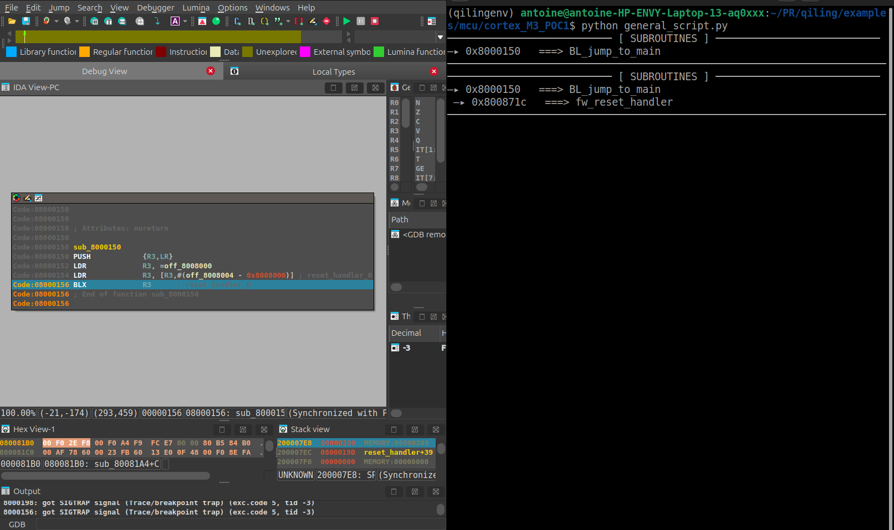

# Baremetal enhanced debugger 
This project is an enhanced debugger based on Qiling, designed for baremetal binaries dealing with MMIO as : firmwares, bootROMs or bootloaders.  

## Motivations, goals, and inspiration
The goal is to allow **emulation/reverse-engineering/debugging** of baremetal binaries that are accessing **unimplemented hardware peripherals using MMIO.**  
The purpose is to provide a simple approach to make faithful emulation of binaries dealing with multiple hardware peripherals without having to reimplement their logics.  
These upgrades were developed with the will to perform fuzzing on well chosen parts of bootROMs and bootloaders. We created this to have an easy way to emulate binaries until reaching these targeted parts in the code.  
To us, this prior fuzzing emulation step, is mandatory to perform a faithful software setup before starting to look for vulnerabilities. 

## Design and features
The added features are entirely based on the Qiling's hooks capacities and modifications of the gdbserver. 

- **MMIOTracker** : tracks accesses to user-defined memory regions corresponding to MMIO registers. It stops the emulation right before such access happens. This allows the user to have an interactive view of the corresponding access. 
    - **Displayed information** : access type, access size, current value in memory and in case of a write, value to be written are displayed. 
    - **User interactions** : in the read access case, the user has the possibility to provide a value before the code fetches it. The value will be placed at the corresponding address in memory.
    - **Values storing logic** : user-provided values are stored in memory during the run and dumped to ```enhanced_debug.json```. Using this, runs are faithfully reproducibles. Values are stored using the MMIO address and the access size as a key. Inside the same key, a pile is created to keep execution order safe. When a read with no user-provided values happens, the current value in memory is stored in the pile. 
    - **Naming MMIO registers** : it is also possible to provide names to MMIO registers accessed during a run. Names will be stored and shown again if the same register is accessed. 

- **SubroutineTracker** : greatly inspired from the Qiling's branch predictor, it helps to detect when the code is entering or leaving a subroutine. It stops execution when a branch leading to a subroutine is detected. 
    - **Displayed information** : address where the branch leads to and four precedent addresses. 
    - **Naming subroutines** : the user has the possibility to name a subroutine to make easier the reverse engineering process. 
    - **Values storing logic** : names are stored in a pile and are linked to the address they correspond to. 

- **MemoryMapper** : map the memory on the fly when an access to unmapped memory region is detected. The user may add restrictions to address ranges that must not be mapped automatically. 


## How to use it ? 

- **Configuration file** :  
There is only one configuration file : ```enhanced_debug.json``` that is used as input and output.  
It gathers the 5 following elements in one json structure: 

```hook_list``` represents the address ranges that the MMIOTracker will track during the execution. Needs to be defined prior execution by the user. 
```json
"hook_list" : [["0x70000000", "0x70003fff"], ["0x7000e400", "0x7000ffff"], ["0x60005000", "0x600053ff"]]
```

```memory_mapping``` represents the address ranges that the MMIOMapper must not map during the execution. This is useful when trying to find vulnerabilities.  
```json
"memory_mapping" : [["0x00000000", "0x00001000"]]
```

```mmio_map``` is generated during the execution and gathers all the names associated to MMIO registers that the user has provided. Names are used in the same run and are dumped in this format in the file for a future run. 
```json
"mmio_map": {"0x70000008": {"size": 4, "name": "UART_DR"}, "0x70000004": {"size": 4, "name": "UART_SR"}}
```

```subroutine_map``` is same feature described above but for subroutines. 

```json
"subroutine_map": {"0x8000150": "jump_to_main", "0x8000156": "jump_to_reset"}
```

```subroutine_pile``` is generated during the execution and allows to restart emulation from a snapshot. 
```json
"subroutine_pile": ["0x100e6c"]
```

- **Recommended usage** :  
one terminal using a reverse-engineering tool or a debugger connected using the gdb remote serial protocol to the gdbserver. A second terminal in which the user started the Qiling's python script in the python environment. This is an example using IDA. 



- **Available commands** :  
When the execution is stopped due to a tracked event, the user can use commands in the CLI terminal related to MMIO tracking. 
    - ```provide 0xaaaaaaaa``` : used when the tracked access is a read, it will place the value in the memory at the corresponding address before the instruction actually fetches it. 
    - ```name mmio GPIOA``` : can be used both with a read or write access. Indicates a name for the corresponding MMIO register. 
    - ```name subroutine main``` : can be used only when the execution stopped for a subroutine detection. Indicates a name for the corresponding subroutine. 
    - ```name subroutine main 0x08001000``` : can be used with no restriction. Indicates a name for the address that must corresponds to a subroutine branching address.
    - ```disable subroutine stop``` : disable the subroutine stopping feature but values and subroutines are still tracked in the background. To enable again the stopping feature same command with enable. 
    - ```disable mmio stop``` : disable the MMIO stopping feature but values are still tracked in the background. To enable again the stopping feature same command with enable.
    - ```save progression``` : will dump all the emulation provided elements in the configuration file but will not stop the execution. 
    - ```save``` : will dump all the emulation provided elements in the configuration file and save the whole emulation state using the qiling ```save``` feature and dump the content into a file named ```execution.bin```. 
    - ```restore```: command to be used in combination with the ```restore``` qiling feature in the user's python script and the ```execution.bin``` file. For the MMIOTracker and SubroutineTracker, this will consume all the values in the file and start to record the emulation as if the run restarted from where it stopped. **The user must be careful, the execution.bin state's and the enhanced_debug state's must be equivalent otherwise a desynchronization will happen.**

- **Enabling the tool in a Qiling script**:

The gdbserver must be enabled in the Qiling script and the ```enhanced_debugger``` option should be added to the line : 

```python
ql.debugger= "gdb:127.0.0.1:9999:enhanced_debugger"
```

## Installation
All available installation methods are described here : [Qiling installation guide](https://docs.qiling.io/en/latest/install/).   
However, it is recommended to use a python virtual environment and follow this method :   
```bash 
mkdir qiling_environment
cd qiling_environment
python3 -m venv qilingenv
source qilingenv/bin/activate
git clone -b enhanced-debug https://github.com/antcpl/qiling-baremetal-enhanced-debugger.git
cd qiling-baremetal-enhanced-debugger && git submodule update --init --recursive
pip3 install .
``` 
After this procedure, two different directories will be available : in the ```qiling_environment``` : 
1. ```qilingenv``` : this is the qiling's core and the python scripts used in the python environment. The modifications and the debugging of the core must be done on the python files of this directory. 
2. ```qiling``` : this directory holds all the Qiling's example scripts and the rootfs that could be used in Qiling. All emulation scripts and developments should be done in this directory. 

## Examples

For the moment only one example is available, more will come later notably designed for ARM Cortex A7 and ARM7TDMI cores. A detailed README is available directly in the [enhanced_debug](./examples/mcu/enhanced_debug) directory. 

- [Cortex_M3_reverse_example](./examples/mcu/enhanced_debug/cortex_M3_reverse_example/)
- [Cortex_M3_bruteforce_example](./examples/mcu/enhanced_debug/cortex_M3_bruteforce_example/)


